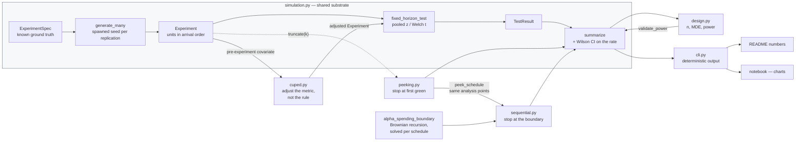

# A/B Testing Kit

> Experiment design and analysis where every claim about error rates is **measured by simulation in this repository**, not quoted from a textbook.

[](https://github.com/Prithv122/ab-testing-kit/actions/workflows/ci.yml)

**Live demo:** not deployed — CLI + notebook, runs locally
**Stack:** Python 3.13 · numpy · scipy · pytest · ruff · uv

> **Status: session 2 of 3.** Power analysis, the peeking demonstration, group-sequential
> alpha spending and CUPED are complete and validated. The Bayesian comparison is the one
> remaining module; §5 grows as it lands.

---

## 1. The problem

A team runs a checkout experiment, watches the dashboard daily, and ships the variant the
morning it first goes green. They believe they are accepting a 5% chance of being wrong,
because that is the number on the tool. They are not.

This toolkit exists to answer the questions a product data scientist gets asked *before* an
experiment starts — how many users do we need, what can we actually detect, when are we
allowed to look — and to prove its answers rather than assert them. Statistical libraries
generally state that a method controls error at some rate. Here, the repository generates
experiments with a **known** true effect, applies the method thousands of times, and reports
the rate that actually came out, with a confidence interval on that rate.

That inversion is the whole design: a claim you can check is worth more than a claim you
can cite.

## 2. The data

| | |
|---|---|
| Source | Simulated in `src/ab_testing_kit/simulation.py`, seeded |
| Size | Generated per run; headline results use 20,000 replications of 3,841 users per arm |
| Licence | n/a — no external data |
| Refresh | Deterministic given `--seed`; every number below carries the command that reproduces it |

**The data is synthetic, and that is a design decision rather than a convenience.** A
measured Type-I error is only meaningful against a *known* truth: you cannot compute how
often a method is wrong without knowing what right was. No public A/B dataset ships a known
true effect, and none carries the pre-experiment covariates CUPED needs alongside one. The
tradeoff is real and worth stating plainly — these results characterise the **methods**
under clean, i.i.d., correctly-specified conditions. They say nothing about how those
methods behave under the messier failure modes of a live experimentation platform:
sample-ratio mismatch, network effects, delayed conversions, or heavy-tailed revenue
metrics. Those are limitations, not oversights, and §7 says what would change.

## 3. Architecture



Every module answers a statistical question against the *same* generated experiments. That
is what makes the comparisons in §5 apples-to-apples: the fixed-horizon, peeking and
sequential rows below differ only in the decision rule applied, never in the underlying data
or seed. `sequential.py` goes one step further and reuses `peeking.py`'s own `peek_schedule`,
so the corrected rule analyses the data at *exactly* the same sample sizes the naive one
does. The only difference left between §5.2 and §5.4 is the number each look is compared
against.

`cuped.py` is the odd one out, and deliberately so: it is the only module that changes the
**metric** rather than the **decision rule**. It hands back an ordinary `Experiment`, so
everything downstream — the fixed-horizon test, the peeking study, the spending boundary —
works on adjusted data without knowing anything about CUPED.

## 4. Key decisions & tradeoffs

| Decision | Chose | Over | Why |
|---|---|---|---|
| Where simulation lives | One shared `simulation.py` owning generation and result types | Each module rolling its own | Makes the central claim checkable. If peeking and fixed-horizon results came from separately-generated data, a difference between them could be a data artefact; sharing the substrate means the decision rule is the only thing that varies. |
| Unit storage | Outcomes stored **in arrival order**, sliced by `truncate(k)` | Regenerating a smaller experiment per look | Consecutive looks must be *correlated*, because in reality they share data. Regenerating would make looks independent and understate the inflation — the bug would have flattered the result. |
| Seeding | `SeedSequence.spawn` per replication | One generator drawn sequentially | Replication *i* is identical whether the study runs 100 or 100,000. A surprising replication can be pulled out and inspected alone. |
| Design formula | Sized for the **pooled** two-proportion z-test | Unpooled / continuity-corrected | It matches the test `fixed_horizon_test` actually applies. Sizing for one test and analysing with another is a quiet route to being under-powered; `validate_power` proves the two stay in step. |
| Test sidedness | Two-sided only | A `two_sided` flag | A one-sided design needs a matching one-sided analysis path. Shipping a parameter no simulation validates would undercut the point of the repo. Documented as a limitation instead. |
| Reporting the rate | Wilson CI on the **rejection rate itself** | Bare point estimate | "Measured error 0.0512" from 10,000 runs carries ±0.004 of Monte Carlo error. Without that interval, a claim that a method controls error is unfalsifiable. |
| Estimate averaging | Over **rejections only** | Over all replications | Averaging over everything hides the winner's curse entirely — the whole second finding in §5. |
| Sequential boundary | Solved here by recursive integration over the Brownian sub-density | Quoting a published boundary table | The premise of the repo is that claims are checked rather than cited, and a table I cannot re-derive is a citation. Solving it also means the boundary adapts to whatever schedule `peek_schedule` produces, including uneven ones. Validated against a direct simulation of the process it integrates — §5.4. |
| Unresolvable alpha budgets | Mark the look `inf`: it cannot reject | Clamp to a large finite z, or loosen the target | The first of twenty O'Brien–Fleming looks budgets ~2e-18, below any quadrature's noise floor. Clamping picks a number to look reasonable; loosening spends alpha the schedule never authorised. `inf` is conservative by construction and the unspent budget rolls forward, so the total still lands on 0.050000. |
| Spending functions | Both O'Brien–Fleming and Pocock | OBF alone | One function shows that sequential testing controls error. Two turn it into a measurable tradeoff — early stopping against final-look power — which is the part worth knowing. |
| Per-look verdicts | Keep the naive `significant` flag beside the sequential decision | Overwrite it with the corrected call | The two disagreeing is the correction doing its job, and keeping both is what makes the like-for-like comparison possible at all. Documented as a footgun and pinned by a test. |
| CUPED reporting | Report the **realised** covariate correlation | The `covariate_corr` that was requested | A binary covariate is generated through a latent-normal copula, so a requested 0.8 realises about 0.51 and buys 26% rather than 64%. CUPED is not underperforming — it delivers `1 - rho²` against the correlation the data actually has. Printing both is the only way that reads as a fact rather than a bug. |
| CUPED covariate generation | Leave the attenuation in, and explain it | Solve `covariate_corr` numerically so the realised value matches the request | A tidier API that makes a true and non-obvious property of binary covariates invisible. The gap is worth more as a lesson than the parameter is as a convenience. |
| CUPED output type | Return an ordinary `Experiment` | A bespoke result type | Composition: the adjusted experiment flows into every other module unchanged. The cost is that `theta` is fitted on whatever is handed in, so adjust-then-truncate would leak the future into an interim look — `cuped_at_each_look` exists to make the right order the easy one. |
| Where results come from | Long CLI runs | The test suite | Tests check correctness and must stay fast; results need many replications. Conflating them gave a 117s suite *and* imprecise numbers. |

## 5. Results

All numbers below are reproducible from a clean clone. Each carries its command. Simulated
data — see §2 for what that does and does not license.

**Scenario:** a checkout conversion rate of 10%, and we want to detect a 2 percentage-point
absolute lift (a 20% relative improvement), at α = 0.05 two-sided and 80% power.

### 5.1 The sample-size formula delivers what it promises

```bash
uv run ab-testing-kit design --metric binary --baseline 0.10 --mde 0.02
```

Design requires **3,841 users per arm** (7,682 total). Running that design 20,000 times
against a *known* 2pp effect:

```bash
uv run ab-testing-kit validate-power --metric binary --baseline 0.10 --n 3841 --effect 0.02 --sims 20000 --seed 0
```

| | Analytic | Simulated (20,000 reps) | 95% CI on the simulated rate |
|---|---|---|---|
| **Power** at the designed n | 0.8000 | **0.8007** | [0.7952, 0.8062] |
| **Type-I error**, one look, true effect = 0 | 0.0500 | **0.0497** | [0.0468, 0.0528] |

The formula falls inside the Monte Carlo interval in both cases. This is the baseline the
rest of the toolkit is measured against: analysed **once**, at the planned horizon, the test
does exactly what it says.

### 5.2 Checking the dashboard 20 times turns a 5% error rate into 25%

Same null data, same seed, same nominal alpha. The *only* thing that changes across rows is
how many times the experiment is analysed before the horizon, stopping at the first
significant look.

```bash
uv run ab-testing-kit peeking --metric binary --baseline 0.10 --n 3841 --looks 1,2,3,5,10,20 --sims 20000 --seed 0
```

| Looks | Measured Type-I error | 95% CI | Mean n per arm at stop |
|---:|---:|---|---:|
| 1 (no peeking) | 0.0497 | [0.0468, 0.0528] | 3,841 |
| 2 | 0.0837 | [0.0799, 0.0876] | 3,745 |
| 3 | 0.1076 | [0.1034, 0.1120] | 3,672 |
| 5 | 0.1403 | [0.1356, 0.1452] | 3,565 |
| 10 | 0.1915 | [0.1861, 0.1970] | 3,393 |
| 20 | **0.2470** | [0.2410, 0.2530] | 3,195 |

**Twenty looks inflates the false-positive rate roughly 5x, from 4.97% to 24.7%.** A team
running this experiment and calling it the first morning it goes green is wrong about one
time in four while believing they are wrong one time in twenty. The intervals are nowhere
near overlapping, so this is not Monte Carlo noise.

Note that the inflation is already material at **two** looks (8.4%) — this is not a problem
that requires an obsessive experimenter, only a curious one.

### 5.3 A subtlety the signed bias hides

The CLI output for the run above carries one more column than the table reproduces: a mean
estimate bias, which comes out near **zero** under the null. That looks at first like
evidence there is no winner's curse. There isn't one *in the signed mean*, and the reason is
worth stating: the test is two-sided, so under a true null the
replications that stop early split symmetrically between spuriously-positive and
spuriously-negative, and the two cancel in the average. The inflation is in the
**magnitude**, not the direction.

Give the experiment a real effect and the direction stops cancelling:

```bash
uv run ab-testing-kit peeking --metric binary --baseline 0.10 --n 3841 --effect 0.02 --looks 1,20 --sims 20000 --seed 0
```

| Looks | Power | Mean n per arm at stop | Mean reported effect | True effect | Overstatement |
|---:|---:|---:|---:|---:|---:|
| 1 | 0.8007 | 3,841 | 0.0224 | 0.02 | +12% |
| 20 | **0.8839** | **1,707** | **0.0337** | 0.02 | **+68%** |

This is the honest version of the tradeoff, and it explains why peeking is tempting rather
than merely careless. Twenty looks **raised** power from 80.1% to 88.4% and reached a
decision on **56% less data** — 1,707 users per arm instead of 3,841. Those are real,
valuable things.

The price is paid twice. Under the null, a 5x inflated false-positive rate (§5.2). Under a
true effect, a shipped estimate of **3.4pp against a true 2pp — a 68% overstatement**. The
team ships a real winner and then misses its forecast by two thirds, which is its own kind
of expensive.

Note that even a single look at a fixed horizon overstates by 12%: conditioning on
significance is *always* mildly optimistic. Peeking multiplies an effect that already exists.

Back under the null, where the signed mean cancels, the column to read is the **magnitude**.
The CLI prints it as `mean |est|`, averaged — like every estimate here — over the
replications that actually rejected and would therefore have shipped:

| Looks | Type-I error | Mean reported \|effect\| among the runs that shipped |
|---:|---:|---:|
| 1 | 0.0497 | 0.0160 |
| 20 | **0.2470** | **0.0373** |

A team peeking twenty times is not only wrong five times as often; when they are wrong, the
effect they announce is **2.3× larger**. Under the null the direction of those estimates is
symmetric — 52.2% positive — which is exactly why the signed bias sits at +0.0002 and says
nothing useful.

Two denominators are easy to confuse here, and the difference matters. Across *all*
replications, shipped or not, the mean absolute estimate is 0.0054 — that is simply the
noise in a 3,841-per-arm experiment. Even a **single** look reports 0.0160 against that,
because conditioning on significance selects for large estimates whatever the schedule.
The 2.3× above is the part peeking is responsible for; the 3× before it is the price of
only ever hearing about experiments that reached significance.


### 5.4 Alpha spending keeps the 5% — and shows its working

The fix for §5.2 is not "look less often". It is to decide **before any data exists** how much
of the 5% each look may consume, and to raise the bar at every look so the total still comes
to 5%.

```bash
uv run ab-testing-kit boundary --n 3841 --looks 5
```

```
 look   n per arm  information  critical z   alpha here   cumulative
--------------------------------------------------------------------
    1         768       0.1999      4.3832    1.170e-05     0.000012
    2       1,536       0.3999      3.1001    1.928e-03     0.001939
    3       2,305       0.6001      2.5531    9.464e-03     0.011404
    4       3,073       0.8001      2.2538    1.703e-02     0.028435
    5       3,841       1.0000      2.0635    2.157e-02     0.050000

total alpha spent    0.050000  (target 0.05)
```

The last line is the point: the budget is exhausted **exactly**, not approximately. The first
look demands z = 4.38 — an effect more than four standard errors from zero — and by the
horizon the bar has relaxed to 2.06, barely above the uncorrected 1.96. O'Brien–Fleming's
entire character is in that column: it refuses to stop early unless the result is
overwhelming, which is exactly why it gives up so little at the end.

**These boundaries are computed here, not copied.** There is no closed form past the first
look, because the looks are correlated — look 3 contains look 2's data. They come from the
standard recursive integration over the Brownian sub-density of the score statistic. Since
that is the kind of code that can be subtly wrong and still look plausible, it is checked
two ways that share none of its logic: against a direct simulation of the Brownian motion it
claims to integrate (200,000 paths × 6 configurations, every crossing rate within 2 SE of
0.05), and against the fact that the Pocock boundary should come out near-constant — the
solver returns 2.438/2.427/2.410/2.397/2.386 for five looks, which brackets the classical
Pocock constant of 2.413 without having been told it.

#### It holds

Same null data, same seed, same analysis points as §5.2. The **only** thing that differs is
the number each look is compared against.

```bash
uv run ab-testing-kit sequential --metric binary --baseline 0.10 --n 3841 --looks 1,2,3,5,10,20 --sims 20000 --seed 0
```

| Looks | Peeking (§5.2) | O'Brien–Fleming | 95% CI on the spending row |
|---:|---:|---:|---|
| 1 | 0.0497 | 0.0497 | [0.0468, 0.0528] |
| 2 | 0.0837 | 0.0498 | [0.0468, 0.0529] |
| 3 | 0.1076 | 0.0498 | [0.0469, 0.0529] |
| 5 | 0.1403 | 0.0515 | [0.0485, 0.0547] |
| 10 | 0.1915 | 0.0519 | [0.0489, 0.0551] |
| 20 | **0.2470** | **0.0515** | [0.0485, 0.0547] |

Every spending row's interval contains 0.05. The naive curve rises by a factor of five across
the same schedule; this one does not move. Pocock behaves the same way (0.0497 / 0.0478 /
0.0481 at 1, 5 and 20 looks) — the guarantee is a property of spending the budget, not of
which shape you spend it in.

#### What it costs

```bash
uv run ab-testing-kit sequential --metric binary --baseline 0.10 --n 3841 --effect 0.02 --looks 1,5,20 --sims 20000 --seed 0
uv run ab-testing-kit sequential --metric binary --baseline 0.10 --n 3841 --effect 0.02 --looks 1,5,20 --sims 20000 --seed 0 --spending pocock
```

All rows: 20,000 replications, true effect 0.02, horizon 3,841 per arm.

| Rule | Looks | Type-I error | Power | Mean n per arm | Data saved | Reported effect |
|---|---:|---:|---:|---:|---:|---:|
| Fixed horizon | 1 | 0.0497 | 0.8007 | 3,841 | — | 0.0224 (+12%) |
| O'Brien–Fleming | 5 | 0.0515 | 0.7882 | 3,037 | 21% | 0.0252 (+26%) |
| O'Brien–Fleming | 20 | 0.0515 | **0.7763** | **2,842** | **26%** | 0.0261 (+31%) |
| Pocock | 5 | 0.0478 | 0.7170 | 2,726 | 29% | 0.0291 (+46%) |
| Pocock | 20 | 0.0481 | 0.6950 | 2,625 | 32% | 0.0321 (+61%) |
| Naive peeking | 20 | **0.2470** | 0.8839 | 1,707 | 56% | 0.0337 (+68%) |

**O'Brien–Fleming at twenty looks buys back 26% of the sample for 2.4 points of power, and
keeps the error rate.** That is the trade the method exists to offer, and it is a good one.

Three things in that table are worth more than the headline:

- **Pocock is not simply worse.** It stops sooner than OBF at every look count, which is what
  it is designed to do. It pays 10.6 points of power for the privilege, most of it at the
  final look, where its bar is 2.39 rather than 2.06. If the cost of running an experiment
  for another fortnight is high and the cost of missing a real winner is low, that is the
  right trade. Choosing a spending function is choosing where you would rather lose.
- **Naive peeking still looks best on the columns a dashboard shows.** Highest power, least
  data. It is the only row that ships a loser one time in four. A method's cost being
  invisible in the metrics people watch is precisely why it survives.
- **The winner's curse shrinks with the boundary.** OBF reports 0.0261 against a true 0.02,
  versus peeking's 0.0337 — because a rule that will not stop early unless the evidence is
  overwhelming stops early less often, and therefore selects on noise less hard. The
  correction that fixes the error rate improves the estimate for free.

Note that two of the twenty looks are marked `never` in the boundary table: O'Brien–Fleming
budgets around 2e-18 for the first look of a twenty-look design, which no numerical scheme
can honour. Those looks are given an infinite boundary and simply cannot reject; the alpha
they do not spend rolls forward, which is why the total still lands on 0.050000. Conservative
by construction — the design spends less than it is entitled to, never more.

### 5.5 CUPED: buy precision with data you already have

Everything above changes the **decision rule**. CUPED changes the **metric**, and it is the
only lever here that makes an experiment genuinely cheaper rather than differently risky.

If a pre-experiment covariate `X` predicts the outcome `Y`, then `Y - theta(X - X̄)` has the
same expectation as `Y` — so the effect estimate stays unbiased — but its variance falls to
`Var(Y)(1 - rho²)`. The promise is precise enough to check, so:

```bash
uv run ab-testing-kit cuped --metric continuous --baseline 0 --n 2000 --effect 0.05 --sims 20000 --seed 0
```

| Requested ρ | Realised ρ | Measured reduction | Predicted (ρ²) | Power raw | Power CUPED | Worth n × |
|---:|---:|---:|---:|---:|---:|---:|
| 0.0 | 0.0000 | 0.0002 | 0.0002 | 0.3497 | 0.3503 | 1.00 |
| 0.2 | 0.1999 | 0.0402 | 0.0402 | 0.3531 | 0.3626 | 1.04 |
| 0.4 | 0.3999 | 0.1601 | 0.1601 | 0.3548 | 0.4072 | 1.19 |
| 0.6 | 0.5998 | 0.3600 | 0.3599 | 0.3526 | 0.5080 | 1.56 |
| 0.8 | 0.7998 | **0.6399** | **0.6398** | 0.3497 | **0.7541** | **2.78** |

Measured reduction matches theory to four decimal places at every point. At ρ = 0.8 the
adjustment more than **doubles power at the same sample size** (35.0% → 75.4%), which is
worth the same as running 2.8× the traffic. It also costs nothing in correctness: under a
true null the adjusted test's Type-I error is 0.0495, and averaged over all replications the
adjusted estimate is unbiased even though `theta` is fitted on the very data it adjusts.

#### The part that surprises people

Run the same sweep on the 10% conversion rate from §5.1 and the picture changes:

```bash
uv run ab-testing-kit cuped --metric binary --baseline 0.10 --n 3841 --effect 0.02 --sims 20000 --seed 0
```

| Requested ρ | **Realised ρ** | Measured reduction | Predicted (ρ²) | Power raw | Power CUPED | Worth n × |
|---:|---:|---:|---:|---:|---:|---:|
| 0.2 | 0.0814 | 0.0066 | 0.0068 | 0.8003 | 0.8030 | 1.01 |
| 0.4 | 0.1875 | 0.0352 | 0.0354 | 0.7991 | 0.8136 | 1.04 |
| 0.6 | 0.3251 | 0.1058 | 0.1060 | 0.7951 | 0.8394 | 1.12 |
| 0.8 | **0.5152** | 0.2656 | 0.2657 | 0.8000 | 0.9049 | 1.36 |

Asking for a correlation of 0.8 yields a realised 0.515, and so 27% variance reduction
instead of 64%. **CUPED is not underperforming** — it delivers exactly `1 - rho²` against the
correlation the data actually has, as the two middle columns show. The gap is in the
covariate: this generator correlates latent normals and *then* thresholds them into 0/1, and
thresholding destroys correlation. The same thing happens to real binary covariates, which is
why "did the user convert last month" is a much weaker CUPED covariate than "how much did the
user spend last month" even when both look equally predictive in a correlation matrix.

This is why the sweep reports the realised correlation next to the requested one. Solving the
generator so the two matched would have made the API tidier and this fact invisible.


## 6. How to run

```bash
git clone https://github.com/Prithv122/ab-testing-kit.git
cd ab-testing-kit
uv sync
uv run pytest
```

No environment variables, no services, no API keys, no dataset download — the data is
generated. Then:

```bash
# How many users do I need?
uv run ab-testing-kit design --metric binary --baseline 0.10 --mde 0.02

# What can I detect with the traffic I have?
uv run ab-testing-kit mde --metric binary --baseline 0.10 --n 5000

# Does that design actually deliver 80% power?
uv run ab-testing-kit validate-power --metric binary --baseline 0.10 --n 3841 --effect 0.02

# What does checking the dashboard every day cost me?
uv run ab-testing-kit peeking --metric binary --baseline 0.10 --n 3841 --looks 1,2,3,5,10,20

# What bar does each look have to clear if I want to keep my 5%?
uv run ab-testing-kit boundary --n 3841 --looks 5

# Does spending the alpha actually hold the error rate?
uv run ab-testing-kit sequential --metric binary --baseline 0.10 --n 3841 --looks 1,2,3,5,10,20

# What is a pre-experiment covariate worth?
uv run ab-testing-kit cuped --metric continuous --baseline 0 --n 2000 --effect 0.05
```

`--help` on any subcommand lists its options. Every command is deterministic given `--seed`.

Runtime note: the headline `peeking` and `sequential` runs at `--sims 20000` take several
minutes each, and `sequential` is the slower of the two because under the null it almost
never stops early and so pays for every look. Drop to `--sims 2000` for a fast look — the
pattern is identical, the intervals are wider. `boundary` is instant; it does no simulation.

## 7. What I'd change at 100× scale

- **Vectorise the analysis loop first.** The bottleneck is scalar scipy calls
  (`norm.sf`, `t.ppf`) executed once per look per replication — a 20-look study at 20,000
  replications is up to 400,000 of them. Computing test statistics across all replications
  as arrays, and replacing per-call `ppf` with a precomputed critical value, is a 10–50×
  win with no change to the statistics. Deliberately not done: for a repository whose
  purpose is that a reader can verify the claims, obviously-correct beats fast.
- **Then parallelise across replications.** `SeedSequence.spawn` was chosen partly for this
  — the children are independent, so replications distribute across processes with no
  coordination and no change to results.
- **Memory becomes the wall before CPU does.** Each replication currently materialises four
  full arrays. At 10⁶ users per arm that is ~32 MB per replication. Streaming sufficient
  statistics (running sums and sums of squares) instead of raw arrays would remove the
  ceiling, at the cost of losing `truncate`'s simplicity — the looks would need to be
  computed forward in one pass.
- **The statistical limits matter more than the computational ones.** Everything here
  assumes i.i.d. units, correctly specified variance, and no interference. A real platform
  at this scale hits sample-ratio mismatch, network effects between users, delayed
  conversions that make early looks biased rather than merely noisy, and revenue metrics
  heavy-tailed enough that the CLT is not a safe assumption at the sample sizes involved.
  Each of those breaks a different assumption in this code, and none of them is visible in
  a simulation that generates clean data. Extending the generator to *produce* those
  pathologies — and measuring which methods survive them — is the version of this project
  that would actually be worth deploying.

---

## References

- Standard two-proportion sample-size formulation follows Fleiss, *Statistical Methods for
  Rates and Proportions* (pooled variance under the null, no continuity correction).
- Welch–Satterthwaite degrees of freedom, and the Wilson score interval, are implemented
  from their standard definitions and cross-checked against `scipy.stats` in the test suite.
- The alpha-spending formulation follows Lan and DeMets; the O'Brien–Fleming and Pocock
  spending functions are their standard closed forms. The boundary solver is the recursive
  numerical integration described by Armitage, McPherson and Rowe, implemented here from the
  Brownian-motion characterisation rather than transcribed. No published boundary table was
  consulted — §5.4 says how the result was checked instead.
- CUPED follows Deng, Xu, Kohavi and Walker's formulation (control for a pre-experiment
  covariate, `theta = Cov(Y,X)/Var(X)`, variance falls to `1 - rho²`). The identity is
  standard; §5.5 measures whether this implementation delivers it.
